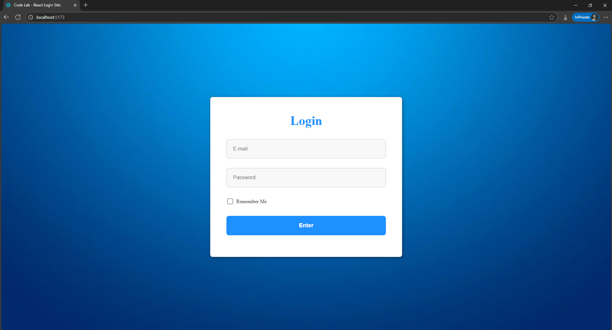

# React Login Site

A simple login page built with **React + Vite**, designed as a frontend-only SPA (Single Page Application).  
This project is part of my personal portfolio and was created for learning and experimentation purposes.



## Features

- Built with **React** and **Vite**
- Basic login form (No backend connection)
- Clean component structure
- Fast refresh and development with Vite
- ESLint for basic code quality

## Getting Started

To run this project locally:

```bash
# Clone the repository
git clone https://github.com/TheSampaio/CodeLab.git
cd CodeLab/projects/frontend/react-login-site

# Install dependencies
npm install

# Start the development server
npm run dev
```
